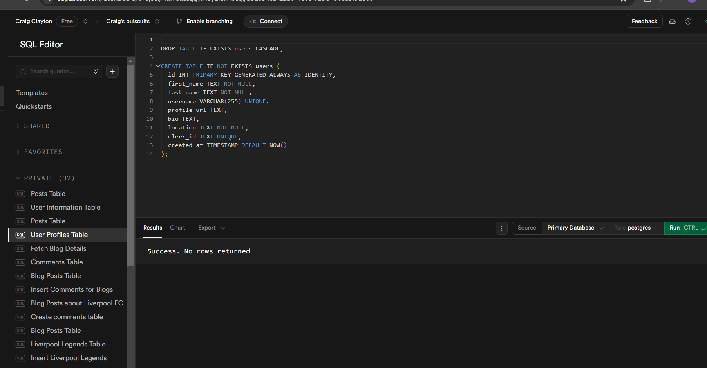
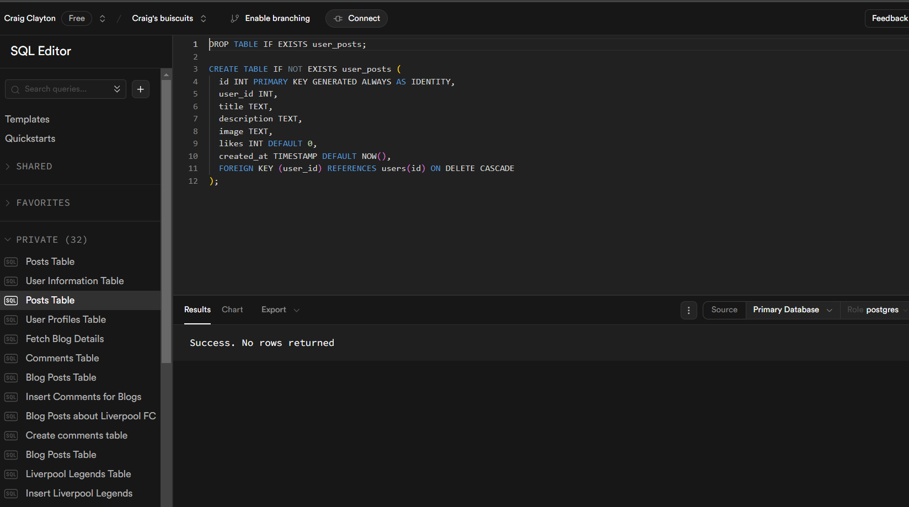

Only a quick reflection this week as I have been ill all weekend and didn't hardly get anything done yesterday (Saturday), so today I have spent alll day catching up.

Not really happy wih this weeks assignment, I feel given more time I could have made it look better and more functionality, but after only learning Clerk for 1 hour in a demo really didn't give me the knowledge needed for this task. Yes I have managed to get things working with Clerk but it feels like a very big hack to get around things, like using ` const canEditOrDelete = user && post.clerk_id === user.id;` in my posts component just to get the edit and delete button only show on the posts if that user is logged in. Surely there is a better way to do it.

As for the components library I used Daisy UI, even though it is Tailwind, I did try to use shadcn a bit yesterday but it messed all my styles up, so I had the idea of `rm -rf week9-assignment` in terminal and then clone the repo down again, however I forgot to copy everything from my `.env.local` file, so I had to start that bit from scratch trying to remember everything I put in it.

As for editing a post, I had to do it the same way as last week, I did try the way Joe gave me in last weeks assignment using an EditPostPage and pass props down to the form, but I couldn't get that to work, I could have done but I was focused on getting everything done, even though there might be better ways to do things.

I used a client component SubmitButton again using react's `useFormStatus` so that I could give some feedback to the user when they submit or save things.

I tried to reuse the Post component.

Now, my biggest obstical was typescript, getting types right was hard, I could have probably reused a couple of types but I was struggling for time and couldn't research properly. Even when I thought it was ok and tried to build on Vercel, I would get build failed because typescript is not happy, so an hour or two wasted there.

I know I could have fetch the user and posts in one sql query and filtered the posts out and then rendered them, but I only realised that a couple hour ago. Also used Joe's template from last week's feedback for joining in the fetchPosts query to get the clerk_id so I could use it for displaying button.

Also the usernames gary and stevie are took, so when creating a user don't use them names.

my error pages sort of work, say 80% of the time.

I didn't create a users route but I made it so if you click on username on the post it will take you to that user's profile.

Suggestion welcome for things I could have done better.
